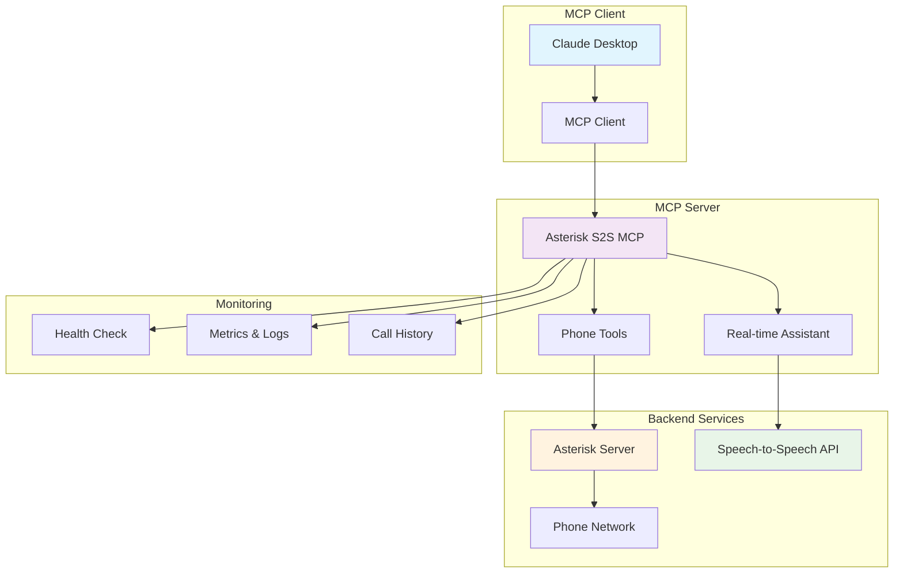
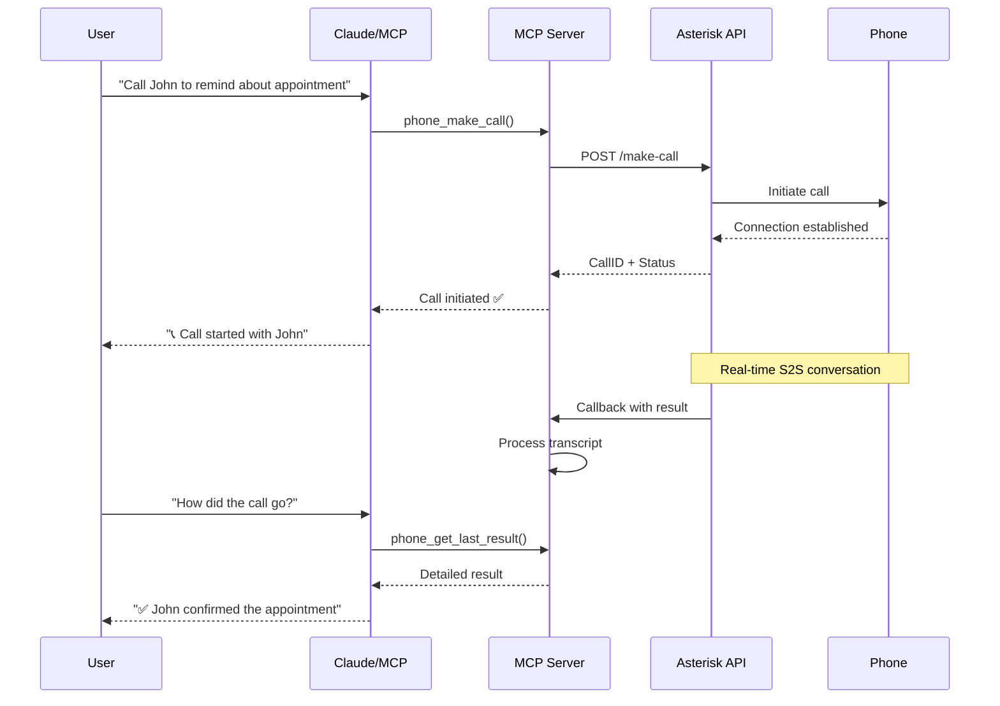
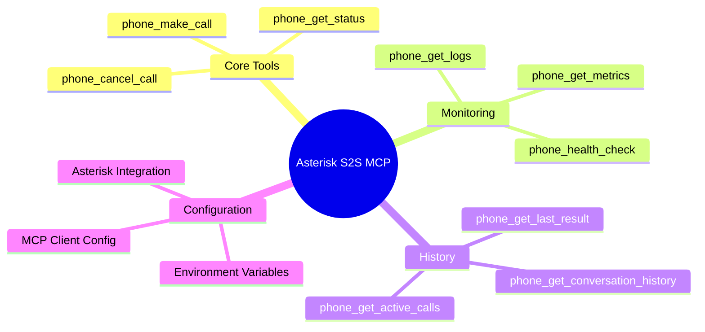
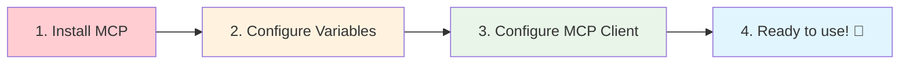
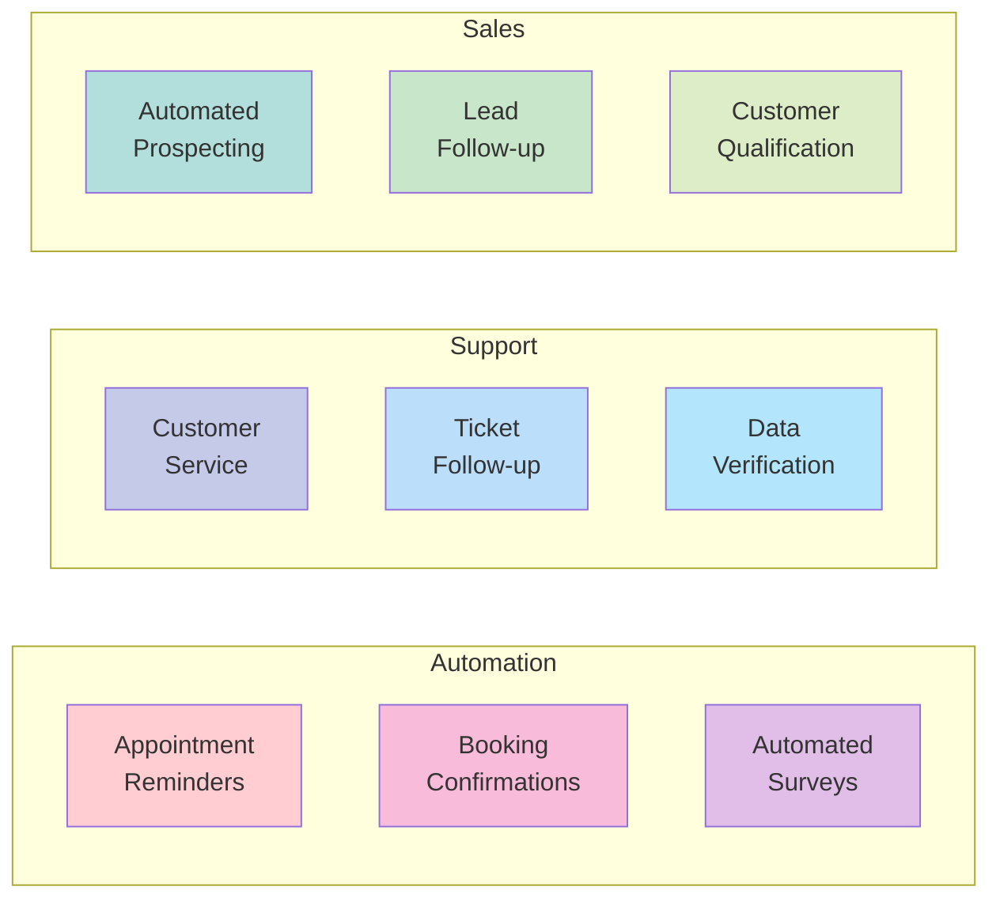
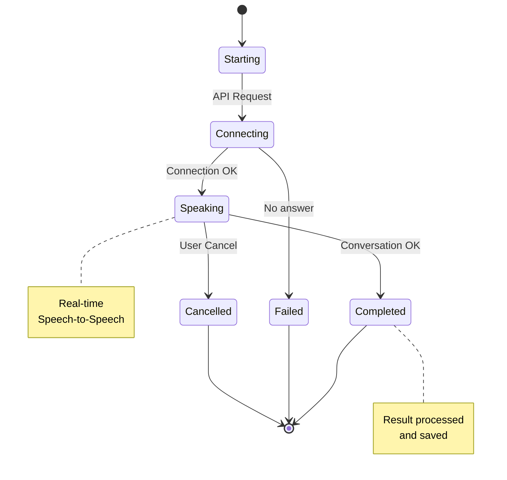
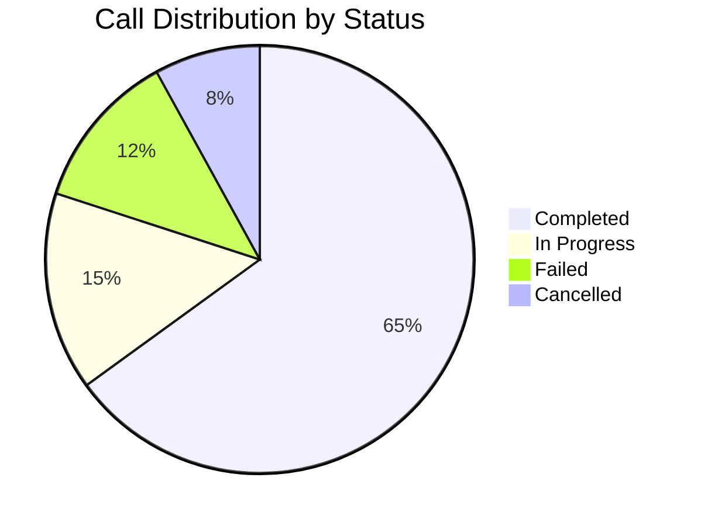
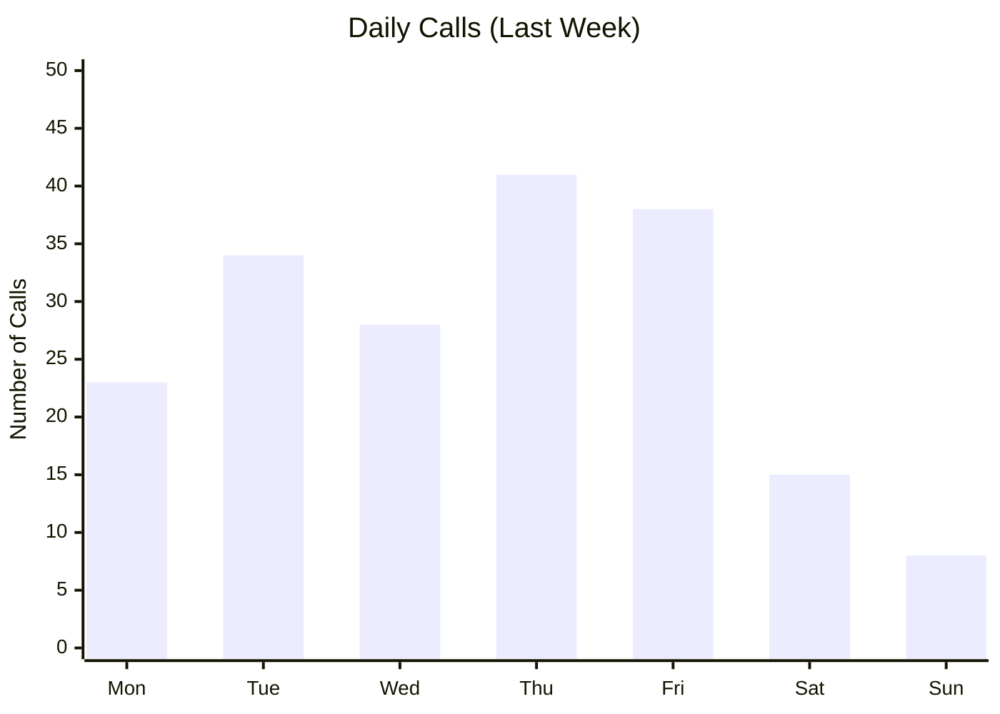
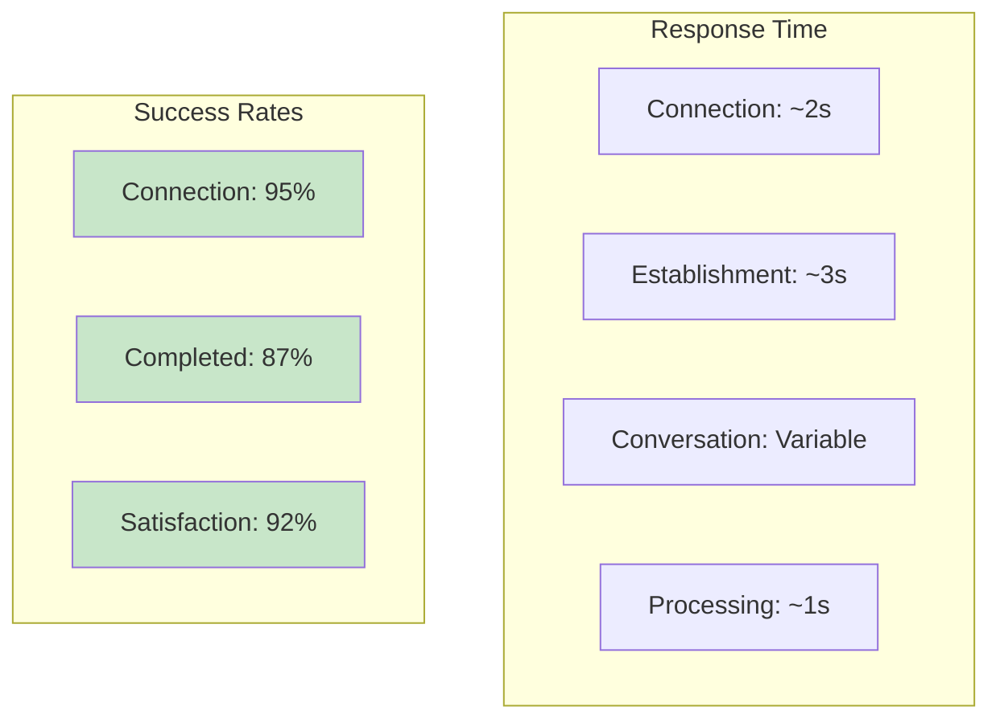

# 🌟 Asterisk S2S MCP Server

<div align="center">


**🚀 MCP Server for automated conversational phone calls using Asterisk with Speech-to-Speech**

*Make phone conversations as easy as a prompt!* 📞✨

</div>

<a href="https://glama.ai/mcp/servers/@gcorroto/mcp-s2s-asterisk">
  
</a>

---

## 🏗️ System Architecture



---

## 📞 Phone Call Flow



---

## 🛠️ MCP Components



---

## 🚀 Installation & Usage

### 🎯 Option 1: NPX (Recommended)
```bash
# One command and you're ready! 🚀
npx @grec0/mcp-s2s-asterisk@latest
```

### 🔧 Option 2: Global Installation
```bash
npm install -g @grec0/mcp-s2s-asterisk
mcp-s2s-asterisk
```

---

## ⚙️ Step-by-Step Configuration



### 🔐 Environment Variables

```bash
# 🌐 Asterisk API URL
export PHONE_API_URL="http://192.168.4.44:8000"

# 🔑 Authentication key
export PHONE_API_KEY="api-key"

# 🔄 Callback URL for results
export MCP_CALLBACK_URL="http://localhost:3000"
```

### 📱 MCP Client Configuration

```json
{
  "mcpServers": {
    "asterisk-s2s": {
      "command": "npx",
      "args": ["@grec0/mcp-s2s-asterisk@latest"],
      "env": {
        "PHONE_API_URL": "http://192.168.4.44:8000",
        "PHONE_API_KEY": "api-key",
        "MCP_CALLBACK_URL": "http://localhost:3000"
      }
    }
  }
}
```

---

## 🧰 Available Tools

<table>
<tr>
<td width="50%">

### 📞 **Calls**
- 🔥 `phone_make_call` - Make phone calls
- 📊 `phone_get_status` - Get call status  
- ❌ `phone_cancel_call` - Cancel calls
- 📱 `phone_get_active_calls` - Active calls

</td>
<td width="50%">

### 📈 **Monitoring**
- ❤️ `phone_health_check` - System health
- 📊 `phone_get_metrics` - Advanced metrics
- 📝 `phone_get_logs` - Detailed logs
- 🗂️ `phone_get_conversation_history` - History

</td>
</tr>
</table>

---

## 💡 Use Cases



---

## 🔄 Call States



---

## 📖 Complete Usage Example

### 🎬 Scenario: Medical Appointment Confirmation

```typescript
// 1️⃣ User tells Claude:
"Call María González at 555-0123 to confirm her appointment tomorrow at 3pm"

// 2️⃣ Claude automatically uses:
phone_make_call({
  usuario: "María González",
  telefono: "555-0123", 
  proposito: "Confirm medical appointment for tomorrow 3pm",
  timeout: 60
})

// 3️⃣ Automatic result:
"✅ Call completed. María confirmed her appointment for tomorrow at 3pm. 
She also asked to change the time to 2:30pm if possible."
```

---

## 🚦 Monitoring Dashboard





---

## 🔧 Local Development

### 📋 Requirements
- 🟢 Node.js >= 18.0.0
- 📦 npm or pnpm
- 🔧 TypeScript

### 🛠️ Quick Setup

```bash
# 📥 Clone repository
git clone <repository-url>
cd mcp-s2s-asterisk

# 📦 Install dependencies  
npm install

# 🔨 Build project
npm run build

# 🚀 Run server
npm run start
```

### 📋 Available Scripts

| Script | Description | Command |
|--------|-------------|---------|
| 🔨 | Compile TypeScript | `npm run build` |
| 👀 | Development mode | `npm run dev` |
| 🧪 | Run tests | `npm run test` |
| 🔍 | MCP Inspector | `npm run inspector` |
| 📦 | Release patch | `npm run release:patch` |

---

## 📊 Performance Metrics



---

## 🔒 Security & Compliance

- 🔐 **Authentication**: Mandatory API Key
- 🛡️ **Encryption**: TLS/SSL in transit
- 📝 **Logs**: Complete call auditing
- 🔒 **Privacy**: Locally processed data
- ✅ **GDPR**: Privacy compliance

---

## 🤝 Contributing

<div align="center">

Do you like the project? We'd love your contribution!

[](https://github.com/grec0/mcp-s2s-asterisk)
[](https://github.com/grec0/mcp-s2s-asterisk/issues)
[](https://github.com/grec0/mcp-s2s-asterisk/pulls)

</div>

---

## 📄 License

<div align="center">

**MIT License** - Use it, modify it, distribute it freely

[](https://opensource.org/licenses/MIT)

</div>

---

<div align="center">

### 🌟 Give it a star if you like the project! ⭐

**Made with ❤️ by [@grec0](https://github.com/grec0)**

*Transforming phone communication with conversational AI*

</div>